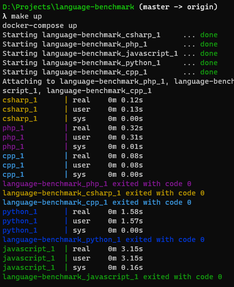

# Language benchmark

This is pretty much to keep track on languages progress when it comes to performance. It's just a small test, with almost no real world scenario. But again, it is just to give us some idea and reference between those languages being tested.

## The Algorithm

The algorithm implemented in all languages is:
 - Read the command line arguments, the first argument is an intergen `n` (the value used in the results is 800000)
 - Convert `n` to a `int` or equivalent in the language
 - Create an `array` of size `n` (when the language support setting a fixed size)
 - For each position in the `array`, fill it with a random `int` between `0` and `n`
 - then sort the `array`

We are using the unix `time` program to measure the benchmark, so JIT languages with slow cold starts will suffer, that's just part of the benchmark

First language to exit wins.

This benchmark tests memory allocation, memory access and memory management. We are not testing threads, nor IO, but I assume IO won't change much on the result board (we are on 2021 and now every language supports async IO anyways), and threads would possibly only benefit GO for a small margin, not worth the hassle.


### Result from 6/nov/2021

#### Machine specs

```
Pop_OS! 21.04 LTS
Docker version 20.10.7, build 20.10.7-0ubuntu1~21.04.2
16 Gb RAM, DDR 4, Dual Channel, 2400Mhz
nVidia GeForce GTX 1070 8GB GDDR5
AMD Ryzen 7 1700 3.1GHz
250GB SSD
```

#### Result

| #  | Language      | Time  |
|----|---------------|-------|
| 1  | C++           | 0.07s |
| 1  | Rust          | 0.07s |
| 1  | C             | 0.07s |
| 4  | Haxe (C++)    | 0.09s |
| 5  | C#            | 0.10s |
| 6  | GO            | 0.16s |
| 7  | JavaScript    | 0.21s |
| 8  | Nim           | 0.22s |
| 9  | PHP           | 0.27s |
| 10 | Haxe (HL/JIT) | 0.30s |
| 11 | Java          | 0.34s |
| 12 | Ruby          | 0.36s |
| 13 | Lua           | 0.42s |
| 14 | Dart          | 0.56s |
| 15 | Swift         | 0.94s |
| 16 | Python        | 1.09s |


##### The swift case

So, Apple claims swift is as fast as C and way faster than Obj-C, so why on earth is it so slow compared to them in this test? There's probrably two reasons for that, I assume.
First reason: maybe swift's compiler is just better optimzed for MacOS and iOS, and we are currently testing on linux not darwin.
Second reason: if you count only the user-space time, you get around 0.11s, which would put swift close to "C", the issue is that at kernel level it takes another ~0.80s, I'm not really sure why that happens, this behaviour can also be seen on "Java"

# Running yourself

Make sure you have `make` and `docker-compose` installed.

Most languages will use the newest availalbe docker image (which means, newest language version), with the exception of `.net`, `haxe` and `java`, since the oficial maintaners don't supply a generic, non-version-specific alpine-based docker image or in the case of `haxe`, it's just a mess.

Just type:

```sh
$ make result
```



# Future languages

This is a list of languages that I want to create versions for (as soon as I have the free time):

- julia
- F#
- closure
- kotlin