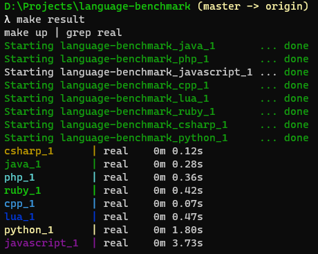

# Language benchmark

This is pretty much to keep track on languages progress when it comes to performance. It's just a small test, with almost no real world scenario. But again, it is just to give us some idea and reference between those languages being tested.

### Result from 17/feb/2021

#### Machine specs

```
Windows 10 Home ver. 2004
Docker version 20.10.2, build 2291f61
16 Gb RAM, DDR 4, Dual Channel, 2400Mhz
nVidia GeForce GTX 1070 8GB GDDR5
AMD Ryzen 7 1700 3.1GHz
250GB SSD
```

#### Result

| #  | Language    | Time  |
|----|-------------|-------|
| 1  | C++         | 0.07s |
| 2  | C#          | 0.12s |
| 2  | C           | 0.12s |
| 4  | GO          | 0.22s |
| 5  | PHP         | 0.27s |
| 6  | Java        | 0.28s |
| 7  | Ruby        | 0.42s |
| 8  | JavaScript  | 0.46s |
| 8  | Dart        | 0.46s |
| 10 | Lua         | 0.47s |
| 11 | Python      | 1.80s |


# Running yourself

Make sure you have `make` and `docker-compose` installed.

Most languages will use the newest availalbe docker image (which means, newest language version), with the exception of `.net` and `java`, since the oficial maintaners don't supply a generic, non-version-specific alpine-based docker image.

Just type:

```sh
$ make result
```

